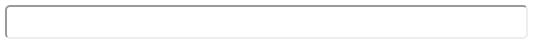
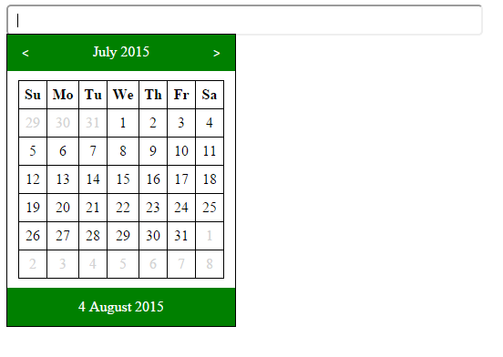
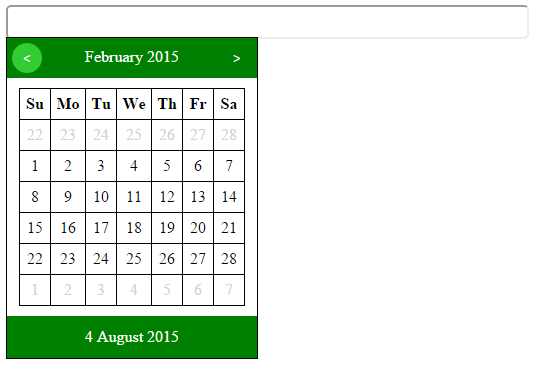
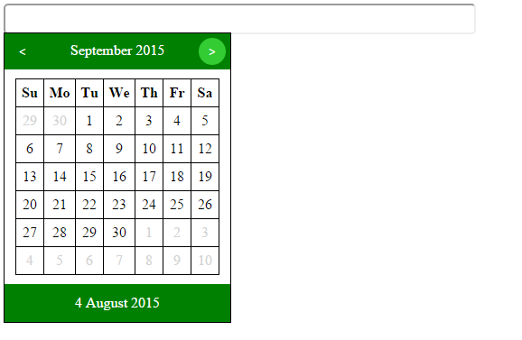
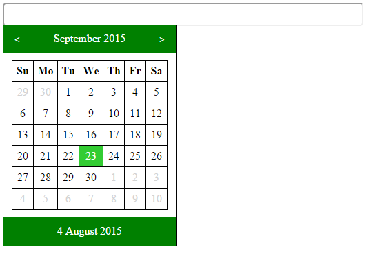
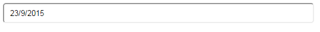
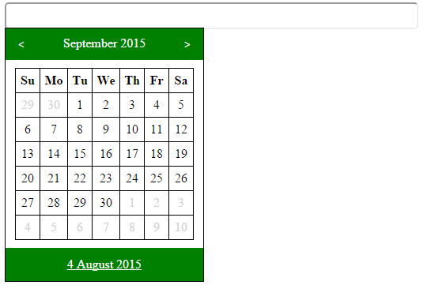
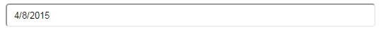
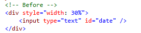
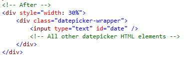

#Task 2: Datepicker

* Given the HTML (`index.html`), CSS (`styles.css`), JavaScript (`scripts.js` and `jquery.min.js`) build a jQuery plugin for a simple datepicker control
* _The datepicker must:_
  * Be built from a simple text input tag
  * Show a calendar with the current month - the calendar should always show 6 rows of data and fill the empty spaces with the previous and next month's dates
  * Allow the user to navigate to the previous and next months
  * Allow the user to select a date from the calendar
  * Always show at the bottom the current date

* _See the pictures below for better understanding of the control_
  * Initial
    
  * Clicking on the input must show the calendar with the current month
    
  * Clicking on the left and right buttons must navigate to the previous or next month
    
	
  * Selecting a date should close the calendar and fill the input with the correct date in the format showed in the picture
    
	
  * Clicking on the current date at the bottom should fill the input with the current date
	
	
	
* _Additional requirements:_
  * You should wrap the input in another element and add all your new HTML elements inside the wrapper (jQuery may help you)
    
	
  * The plugin should support chaining
  * Clicking on the previous or next month dates should not populate the input value
  * **IMPORTANT**: Always attach your events by classes and not by HTML elements!
  * **HARDCORE TASK**: Initially when the input is focused - the calendar should show. Add the functionality to hide the calendar only if the user clicks outside of the datepicker control
  
* _Hints:_
  * The provided CSS will help you build the HTML structure of the plugin
  * See the windows calendar to compare it with your control
  * Useful Date functions in JavaScript
    * `var date = new Date()` - returns the current date and time
	* `var date = new Date(2016, 11, 3)` - returns a date instance with information for December 3rd 2016 (January is zero)
	* `date.getDate()` - returns the date number from the date's instance object
	* `date.getMonth()` - returns the zero-based month index from the date's instance object (zero is January)
	* `date.getFullYear()` - returns the year from the date's instance object
	* `date.getDay()` - returns the day from the week from the date's instance object (zero is Sunday)
	* `date.setMonth(0)` - sets the month of the date's instance object to be January
    * `date.setDate(1)` - sets the date of the date's instance object to be the first day of the month
	* More available <a href="http://lmgtfy.com/?q=javascript+date+mdn">HERE</a> and <a href="http://lmgtfy.com/?q=javascript+get+last+day+of+month">HERE</a> 
  * Some functionality is already written to help you. Thank me later! :)
  
* _Constaints:_
  * You must alter only the scripts (JavaScript) and do not touch the HTML structure or the CSS styles
  * You must use jQuery to alter the DOM and build the plugin. You are not allowed to use the native document API
  * You are allowed only to edit the contents of the file "scripts.js"
  * You are NOT allowed to edit the contents of the HTML and/or the CSS files

* _Don't be sad! Here is a picture of cat to cheer you up:_
  

# Steps for building UI components with JavaScript

### Analyze the problem
- Go through the description carefully
- What should we do?
    - Dynamically build a datepicker from an input field
        - What elements should we create and use?
            - Take a look at the provided CSS file - `styles.css`
            - `table` elements are convinient for filling the calendar
            - `a` elements are appropriate for the buttons
            - `div` elements are useful for wrappers
        - What events should we attach?
            - There are buttons in the datepicker, so probably `click`
            - Selecting a date from the datepicker, `click` again
            - Focusing the initial input field, so `focus` or `click`
        - To which elements should we attach the events?
            - Try to attach events to parent elements for better performance

### Solving the problem
- Create the datepicker
    - You'll need to wrap the input field and the datepicker into a container
    - Create the datepicker elements
        - The header with the current month
            - Create 2 buttons for month navigation - `a` elements are appropriate
                - Attach navigation events to them
                - Remember you can use custom attributes
            - Create an element that will contain the current month - `p`, `div` and `strong` are all good
        - The month calendar
            - Create a `table`
                - The header should contain the days of the week
                - The body should contain the days of the month
                    - Look at the pictures in the description to get a good understanding of how the days of the month are displayed
                    - Think of how to generate the days for display in each month
                    - When a day of the month is clicked, it's value should be entered in the input field
                    - The calendar of your own PC is your friend :)
        - The datepicker footer
            - Should contain an element with the current date - `a` is appropriate
                - When clicked should set the value of the input to the current date
    - You plugin should enable chaining

- Useful jQuery things: .addClass(class), .toggleClass(class), .removeClass(class), .wrap(element), .appendTo(element), .append(element), .text(string), .html(string), creation and selection of elements with jQuery, event attaching with selectors